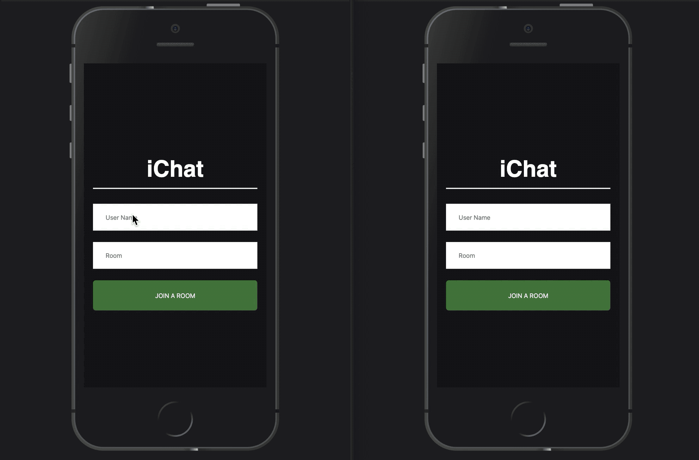

# iChat

Online Live Chat Application

### Live Demo: [ichattpro.netlify.com](http://ichattpro.netlify.com)



## Getting Started

These instructions will get you a copy of the project up and running on your local machine for development and testing purposes.

### Initial Setup

1. Fork this repo and clone your fork from the terminal.

```
$ git clone https://github.com/[user_name]/iChat.git
```

2. Navigate into the cloned directory and install the necessary dependencies.

```
$ npm install
```
* Initiate the server

```
$ npm start
```

4. Go to localhost:3000 and enjoy 😃


## Built With

* React.JS
* NodeJS
* Express
* Socket.io
* CSS


## Contributing

Please feel free to fork this repo, make changes, submit pull requests, and send suggestions to dseongdev@gmail.com to make this app better.

## Author

* **Daniel Seong** - *Initial work* - [dseong0224](https://github.com/dseong0224)
